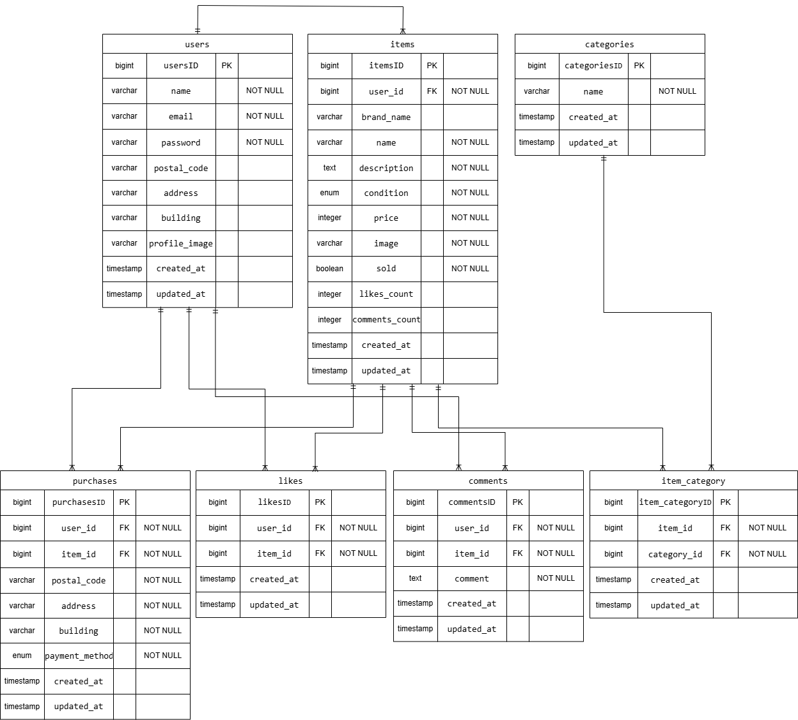

# フリマアプリ

## 環境構築

### Docker ビルド

1.  git clone <リポジトリのリンク>
2.  docker-compose up -d --build

＊ MySQL は OS によって起動しない場合があります。その場合は、docker-compose.yml ファイルを編集し、それぞれの PC に合わせて調整してください。

### Laravel 環境構築

1.  docker-compose exec php bash
2.  composer install
3.  .env.example をコピーして.env ファイルを作成し、環境変数を変更 
    ※.env ファイルの DB_DATABASE、DB_USERNAME、DB_PASSWORD の値を docker-compose.yml に記載の値に変更
4.  php artisan key:generate
5.  php artisan migrate
6.  php artisan db:seed
7.  php artisan storage:link

## 使用技術

-   PHP: 8.4.1
-   Laravel: 8.83.8
-   MySQL: 8.0.26
-   mailhog

## 機能補足（商品購入機能）

-   購入機能について基本要件と応用要件を両立させるため、商品購入ページにて コンビニ払いを選択して購入する → そのまま Sold 処理が実行される カード払いを選択して購入する →stripe の決済画面に移動する
-   stripe の決済画面に移動できるようにするため.env ファイルの 
    STRIPE_PUBLIC=your-public-api-key-here 
    STRIPE_SECRET_KEY=your-secret-api-key-here 
    に Stripe のダッシュボードから API キーを取得して記述する
-   stripe 決済画面においてテスト環境で支払いを実行するため仮想の情報を入力して支払うをクリックする 
    例：カード番号 4242 4242 4242 4242
    有効期限 12/30
    セキュリティコード 123 
    メールアドレス sample@stripe.com
    カード保有者の名前 Test User

## テストコード補足

-   会員登録機能(全ての項目が入力されている場合、会員情報が登録され、ログイン画面に遷移される) 
    → 応用要件に合わせてメール認証画面へ遷移されるように設定
-   マイリスト一覧取得(未認証の場合は何も表示されない) 
    → 機能要件に合わせて未認証の場合ログイン画面へ遷移されるように設定
-   コメント送信機能(ログイン前のユーザーはコメントを送信できない) 
    → ログインしてコメントするというボタンからログイン画面へ遷移されるように設定(コメント欄は未表示)

## URL

-   開発環境: [http://localhost/](http://localhost/)
-   phpMyAdmin: [http://localhost:8080/](http://localhost:8080/)

## ER 図

